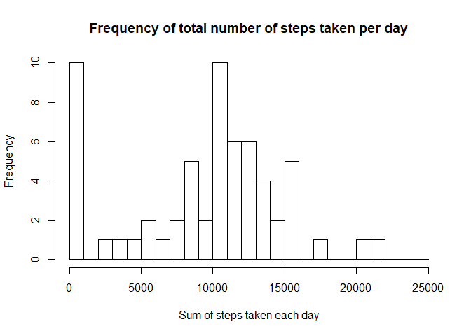
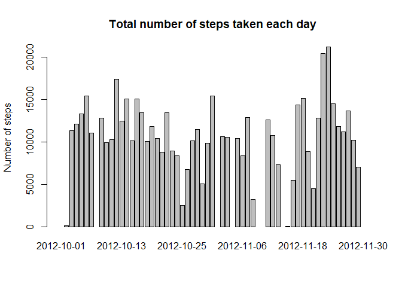
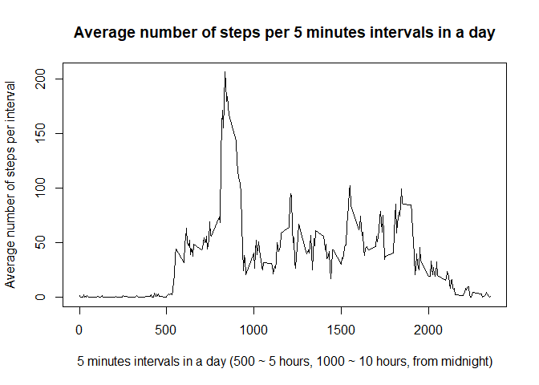
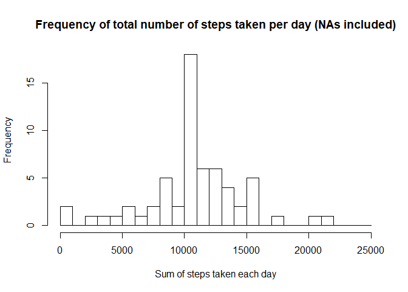
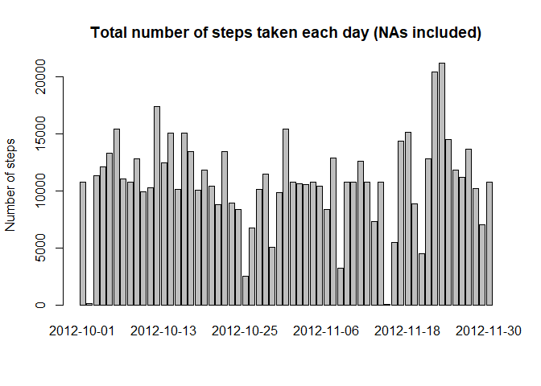
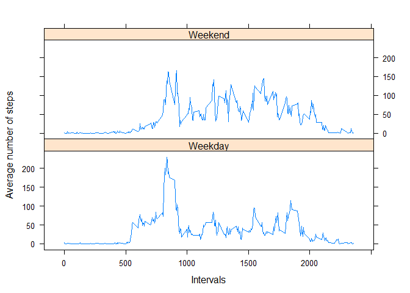

## Loading and preprocessing the data

The first step will be to load the data, give ourselves an idea of what does this dataset look like, check its formats and change them if needed.

```r
file <- read.csv("activity.csv")
head(file)
```

```
##   steps       date interval
## 1    NA 2012-10-01        0
## 2    NA 2012-10-01        5
## 3    NA 2012-10-01       10
## 4    NA 2012-10-01       15
## 5    NA 2012-10-01       20
## 6    NA 2012-10-01       25
```

```r
str(file)
```

```
## 'data.frame':	17568 obs. of  3 variables:
##  $ steps   : int  NA NA NA NA NA NA NA NA NA NA ...
##  $ date    : Factor w/ 61 levels "2012-10-01","2012-10-02",..: 1 1 1 1 1 1 1 1 1 1 ...
##  $ interval: int  0 5 10 15 20 25 30 35 40 45 ...
```
The date needs to be modified from factor to date

```r
file$date <- as.Date(as.character(file$date), "%Y-%m-%d")
str(file)
```

```
## 'data.frame':	17568 obs. of  3 variables:
##  $ steps   : int  NA NA NA NA NA NA NA NA NA NA ...
##  $ date    : Date, format: "2012-10-01" "2012-10-01" ...
##  $ interval: int  0 5 10 15 20 25 30 35 40 45 ...
```

## What is mean total number of steps taken per day?

To answer this question, we will look first at what is the most frequent total number of steps per day: 


```r
hist(tapply(file$steps, file$date, sum, na.rm = TRUE), breaks = seq(0,25000,1000), main = "Frequency of total number of steps taken per day", xlab = "Sum of steps taken each day")
```

<!-- -->

We can also create a barplot with the total number of steps taken each day:


```r
barplot(tapply(file$steps, file$date, sum), main = "Total number of steps taken each day", ylab = "Number of steps")
```

<!-- -->

We will now calculate the mean number of steps taken each day. We will first create a dataframe in which to save the total number of steps taken each day, removing any potential NA. Then we will use that data to calculate the average number of steps per day, and the median.


```r
t <- data.frame(tapply(file$steps, file$date, sum, na.rm = TRUE))
cat("The average number of steps per day is ", mean(t[,]))
```

```
## The average number of steps per day is  9354.23
```

```r
cat("The median number of steps is ", median(t[,]))
```

```
## The median number of steps is  10395
```

## What is the average daily activity pattern?

We will have a look at what is the pattern of movement in a day using the intervals in the dataset. In particular, we will look at what is the number of steps for each interval, on average, which will inform on which periods of the days tend to be more active.

First, we will create a dataframe containing the intervals, and the average of steps in each interval.


```r
p <- data.frame(tapply(file$steps, file$interval, mean, na.rm = TRUE))
p$interval <- rownames(p)
```

Secondly, we will plot the average number of steps per interval:


```r
plot(p$interval, p$tapply.file.steps..file.interval..mean..na.rm...TRUE., type = "l", xlab = "5 minutes intervals in a day (500 ~ 5 hours, 1000 ~ 10 hours, from midnight)", ylab = "Average number of steps per interval", main = "Average number of steps per 5 minutes intervals in a day")
```

<!-- -->


## Imputing missing values

As NAs can introduce bias into the analysis, let us calculate how many missing values there are in the initial dataset


```r
length(which(is.na(file)))
```

```
## [1] 2304
```

Then, let us fill in these missing values. We will use the mean value for that 5 minutes interval. We will create a new dataset to keep a clean copy of the original data.


```r
file_n <- file
file_n$steps[is.na(file_n$steps)]<- p$tapply.file.steps..file.interval..mean..na.rm...TRUE.[match(file_n$interval, p$interval)][which(is.na(file_n$steps))]
```

This operations takes all the positions of the "steps" column in which there is an NA, and gives them the average number of steps for the interval found in the dataset build before by matching the interval numbers. 

We will produce now the same plots as before, showing the most frequent total number of steps per day: 


```r
hist(tapply(file_n$steps, file_n$date, sum, na.rm = TRUE), breaks = seq(0,25000,1000), main = "Frequency of total number of steps taken per day (NAs included)", xlab = "Sum of steps taken each day")
```

<!-- -->

And the barplot with the total number of steps taken each day:


```r
barplot(tapply(file_n$steps, file_n$date, sum), main = "Total number of steps taken each day (NAs included)", ylab = "Number of steps")
```

<!-- -->

The differences we notice are related to the fact that days that before amounted to 0, are now days with an activity that is equal to the average activity.

As before, we calculate mean and median


```r
t_n <- data.frame(tapply(file_n$steps, file_n$date, sum))
cat("The average number of steps per day is ", mean(t_n[,]))
```

```
## The average number of steps per day is  10766.19
```

```r
cat("The median number of steps is ", median(t_n[,]))
```

```
## The median number of steps is  10766.19
```
## Are there differences in activity patterns between weekdays and weekends?

Let's first create a new field in which to store the day of the week.
Then, we will replace each day of the week with the word "Weekday" or "Weekend" appropriately.

```r
file_n$dayofweek <- weekdays(file_n$date)
file_n$dayofweek[which(weekdays(file_n$date)=="Saturday" | weekdays(file_n$date) == "Sunday")]<- "Weekend"
file_n$dayofweek[which(file_n$dayofweek !="Weekend")]<- "Weekday"
```

Next, we will plot activity patterns by intervals on weekend and weekdays, to notice whether there are differences.


```r
m <- aggregate(file_n$steps,by=list(file_n$interval,file_n$dayofweek),FUN=mean)
library(lattice)
xyplot(m$x ~ m$Group.1 | m$Group.2, type = 'l', layout = c(1,2), xlab = "Intervals", ylab = "Average number of steps")
```

<!-- -->

Clearly, on weekdays the most of the steps are taken before 10 AM, and are reduced in other moments of the day. On weekends, activity is spread throughout the day.
